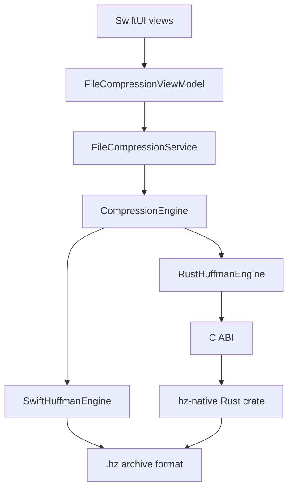

# hz

hz is a macOS Huffman archiver with Swift and Rust implementations of the same `.hz` archive format.

The repository contains a SwiftUI drag-and-drop application, a Swift reference codec, a Rust native backend linked through a C ABI, and benchmark tooling for comparing single-layer, recursive, and streaming compression paths.

## Features

- Huffman compression and decompression for byte-oriented data.
- Versioned `.hz` archive format with explicit original byte count, encoded bit count, and frequency table metadata.
- Deterministic archive generation across the Swift and Rust implementations.
- Adaptive and forced-depth recursive compression, with the accepted layer count recorded in the outer archive.
- Swift reference implementation split into archive, tree, frequency, bit I/O, codec, service, and view-model components.
- Rust native backend for single-layer archive compression and decompression.
- Rust streaming file compression and decompression through bounded-memory APIs.
- C ABI bridge used by the Swift application and tests.
- Golden archive fixtures, Swift/Rust compatibility tests, streaming tests, FFI tests, and benchmark smoke coverage.
- Benchmark runner for Swift, Rust in-memory, Rust streaming, adaptive recursion, and forced recursion.

## Architecture

The application is SwiftUI, but compression is accessed through a small engine abstraction:

```swift
protocol CompressionEngine {
    func compress(_ input: Data, options: CompressionOptions) throws -> CompressionResult
    func decompress(_ archive: Data, options: DecompressionOptions) throws -> Data
}
```

`SwiftHuffmanEngine` is the default reference engine. `RustHuffmanEngine` calls the native static library through `HzNative` and preserves the same recursive compression contract at the Swift boundary.



The Swift implementation owns presentation, file workflow, recursive orchestration, and the reference codec. The Rust backend owns native single-layer Huffman compression/decompression and path-based streaming file operations. Both implementations read and write the same `HZF1` version 2 archive format.

Streaming support is intentionally scoped:

- Rust compression streams from `Read + Seek` input to `Write` output using two bounded passes.
- Rust decompression streams from any `Read` input to `Write` output.
- Rust file helpers write through a temporary destination and rename on success.
- Swift reference compression and recursive/adaptive compression remain in-memory.

## Quick Start

Requirements:

- macOS with Xcode installed.
- Rust toolchain with Cargo for the native backend.
- Apple Silicon macOS target by default: `aarch64-apple-darwin`.

Clone and open the app:

```bash
git clone https://github.com/htaschne/hz.git
cd hz
open hz.xcodeproj
```

Build the macOS app from the command line:

```bash
xcodebuild build -scheme hz -destination 'platform=macOS'
```

Run the Swift test target:

```bash
xcodebuild test -scheme hz -destination 'platform=macOS' -only-testing:hzTests
```

Build and test the Rust native backend:

```bash
make native
make native-test
```

Run a baseline benchmark:

```bash
benchmarks/run.sh --engine swift --max-depth 0
```

Run native benchmark modes:

```bash
benchmarks/run.sh --engine rust --max-depth 0
benchmarks/run.sh --engine rust-stream --max-depth 0
```

## Using The App

The macOS app provides the primary user interface:

- Drag a file onto the window to compress it.
- Drag a `.hz` archive onto the window to decompress it.
- Choose the destination path in the save panel.

The default application engine is the Swift reference implementation. The Rust backend is available in the codebase through `RustHuffmanEngine` and is covered by the native compatibility tests.

## Archive Format

Current archives use the `HZF1` version 2 format:

- magic bytes: `HZF1`;
- little-endian integer fields;
- flags, currently required to be `0`;
- outer archive recursive layer count;
- original uncompressed byte count;
- encoded bit count;
- sorted byte frequency table;
- MSB-first Huffman payload.

The archive stores frequencies, not serialized canonical code lengths. Decoders reconstruct the deterministic Huffman tree from the frequency table and use `encodedBitCount` plus `originalByteCount` to avoid decoding padding bits as output.

See [docs/ARCHIVE_FORMAT.md](docs/ARCHIVE_FORMAT.md) for the normative byte layout, malformed archive rules, recursive archive behavior, pseudocode, and golden examples.

## Documentation

- [docs/ARCHIVE_FORMAT.md](docs/ARCHIVE_FORMAT.md): normative `.hz` archive specification.
- [docs/NATIVE_ENGINE.md](docs/NATIVE_ENGINE.md): Rust backend, C ABI, ownership rules, Xcode integration, and compatibility notes.
- [docs/NATIVE_STREAMING_DESIGN.md](docs/NATIVE_STREAMING_DESIGN.md): streaming design constraints and current boundaries.
- [benchmarks/README.md](benchmarks/README.md): benchmark runner commands, workloads, outputs, and CSV fields.

## Research

Research manuscripts and reproducibility artifacts live under [papers/](papers/):

- [papers/recursive-huffman/](papers/recursive-huffman/): recursive/adaptive Huffman behavior.
- [papers/implementation-benchmarks/](papers/implementation-benchmarks/): implementation trade-offs across Swift in-memory, Rust in-memory, and Rust streaming modes.

See [papers/README.md](papers/README.md) for the research index and artifact policy.

## Repository Layout

```text
.
├── hz/                  SwiftUI app, Swift codec, engine abstraction, services
├── hzTests/             Swift unit and native compatibility tests
├── hzUITests/           Xcode UI test target
├── native/              Rust static library, C header, module map
├── docs/                Archive, native backend, and streaming documentation
├── benchmarks/          Benchmark runner, generated workloads, result folders
├── scripts/native/      Native build, test, header, and clean scripts
├── papers/              Research manuscripts and reproducibility artifacts
├── Mocks/               Sample input data
└── hz.xcodeproj         macOS Xcode project
```

## Benchmarks

The benchmark runner compiles the production Swift engine sources with `swiftc -O`. Rust modes build `native/hz-native` first, compile the runner with the native bridge enabled, and verify decompression for each workload.

Benchmark modes:

- `--engine swift`: Swift reference engine.
- `--engine rust`: Rust backend through the in-memory Swift wrapper.
- `--engine rust-stream`: Rust path-based file streaming API.
- `--adaptive`: recursive compression that stops before a non-smaller candidate.
- `--max-depth N`: forced recursive compression depth.

Examples:

```bash
benchmarks/run.sh --engine swift --adaptive
benchmarks/run.sh --engine swift --max-depth 3
benchmarks/run.sh --engine rust --max-depth 0
benchmarks/run.sh --engine rust-stream --max-depth 0
benchmarks/run.sh --input Mocks/bible.txt --max-depth 0
```

Analyze generated CSV files:

```bash
benchmarks/analyze.py
```

Results are written under `benchmarks/results/`. Generated CSV files and raw archives are ignored by git.

## Testing

The test suite covers:

- Swift reference round trips for text, empty input, single-byte input, binary data, non-byte-aligned payloads, corrupted headers, invalid magic, truncation, and padding bits.
- Recursive compression behavior, layer counts, partial decompression, deterministic output, and stopping rules.
- Rust native round trips, archive compatibility with Swift, padding behavior, invalid magic, truncation, and native availability.
- Rust file streaming through the Swift service layer.
- Rust unit tests for archive parsing/serialization, golden fixtures, bit readers/writers, frequency counting, tree construction, canonical code helpers, streaming, and FFI.

Common validation commands:

```bash
xcodebuild test -scheme hz -destination 'platform=macOS' -only-testing:hzTests
make native-test
cargo test --manifest-path native/hz-native/Cargo.toml --all-targets
```

## Development

Native build commands:

```bash
make native
make native-release
make native-test
make native-header
make native-clean
```

Rust formatting and linting:

```bash
cargo fmt --manifest-path native/hz-native/Cargo.toml --check
cargo clippy --manifest-path native/hz-native/Cargo.toml --all-targets -- -D warnings
```

App validation:

```bash
xcodebuild build -scheme hz -destination 'platform=macOS'
xcodebuild test -scheme hz -destination 'platform=macOS' -only-testing:hzTests
```

The checked-in C header is manually maintained at [native/hz-native/include/hz_native.h](native/hz-native/include/hz_native.h). Keep it in sync with Rust `#[repr(C)]` definitions and validate it with `make native-header`.

There is no Swift Package manifest in this repository; the macOS application is built through [hz.xcodeproj](hz.xcodeproj). There is no committed GitHub Actions configuration at this time.

## Current Boundaries

- The default app engine is Swift.
- The Rust native backend is integrated and tested, but recursive/adaptive orchestration still happens in Swift.
- Rust streaming is single-layer; recursive streaming would require a temporary-file candidate strategy.
- The buffer-based C ABI functions remain in-memory for compatibility with the Swift engine wrapper.
- The current native build scripts target Apple Silicon macOS unless `HZ_NATIVE_TARGET` is overridden.

## License

hz is distributed under the MIT License. See [LICENSE](LICENSE).
